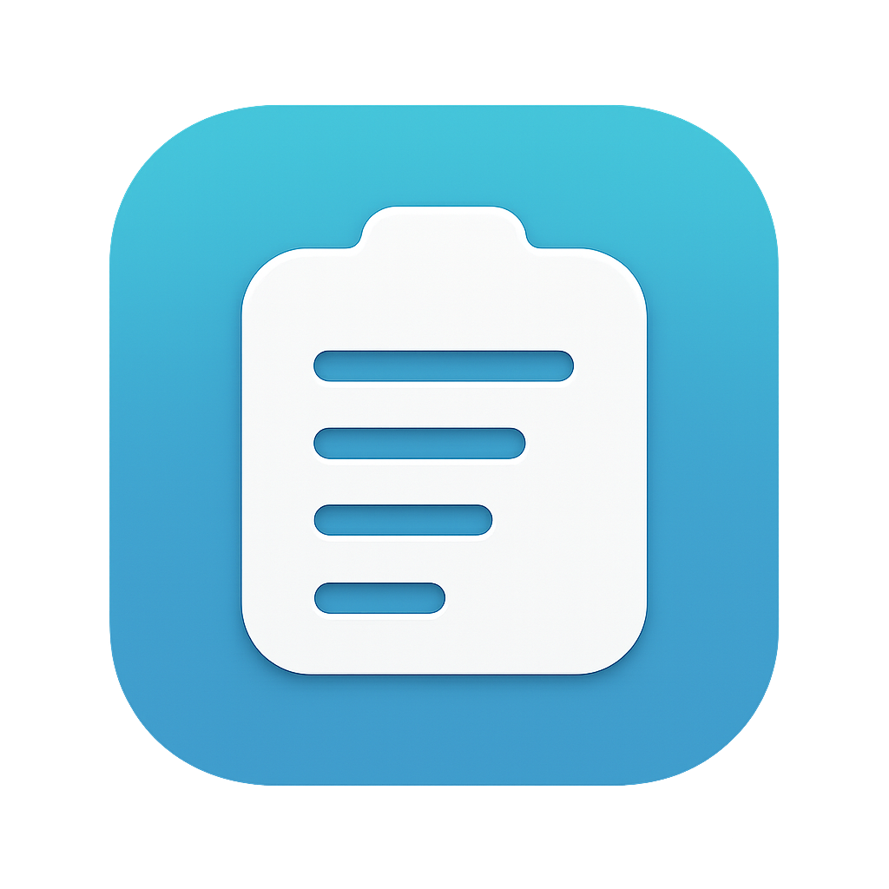
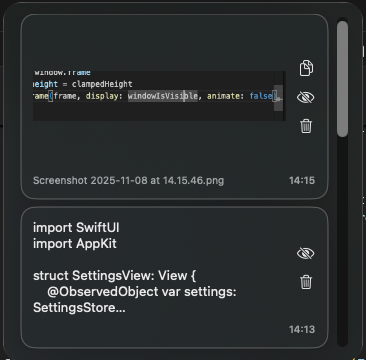
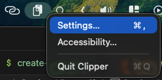
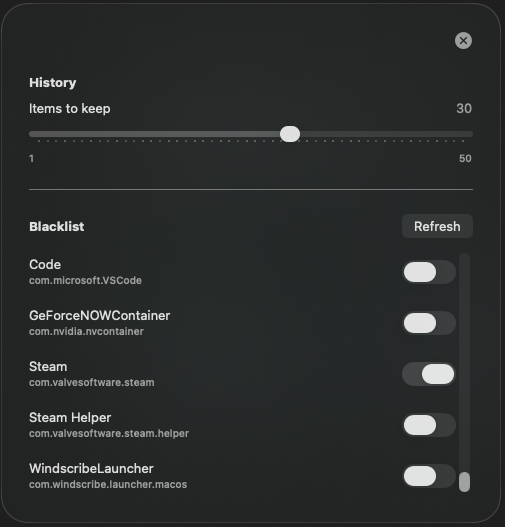

# Clipper


Clipper is a lightweight macOS menu bar helper inspired by the Windows clipboard history. It keeps the last 30 (customizable) items you copy (text or images), presents a quick popover anchored to the cursor, and lets you re-paste with a single click.








## Features

- Global hotkey (`⌘⇧V`) to open the clipboard history anywhere.
- Menu bar icon for quick access, with an auto-hiding window that appears near your cursor.
- History for the 30 most recent clipboard entries, including plain text and screenshots/images.
- One-click paste: selecting an entry copies it back to the pasteboard and sends a `⌘V`.
- Per-item privacy controls to censor (mask with `*`) or delete individual entries.
- Simple Settings window with a slider to choose how many entries to keep (1–50), a blacklist for ignoring specific apps, a launch-at-login toggle, and Escape-to-close behavior so it feels just like the main popover.
- File-aware clipboard entries: screenshots, camera captures, and Finder files show live previews that scale to the tile width, preserve original filenames, and expose a path button so you can copy the underlying file path (or paste the image/file) with a single click.
- Visual status badges tell you whether a screenshot went straight to the clipboard (`⌃⌘⇧3/4` → “Copied directly to clipboard”) or was saved as a file first (`⌘⇧3/4` → shows the generated filename).
- Refined history cards keep file info/path text and timestamps on a single line beneath each preview while stacking action icons vertically to use the available space more efficiently.
- Menu-bar context menu (right-click) with quick access to Settings, Accessibility permissions, and Quit.
- Optional Accessibility shortcut to request the system permission needed for the global hotkey.

## Requirements

- macOS 13 Ventura or newer.
- Xcode 15 toolchain (or Swift 5.9+) installed locally.

## Development

```bash
swift build          # Compile the app
swift run Clipper    # Launch from the command line

# Build a standalone .app bundle
cd scripts
./build-app.sh       # or: bash build-app.sh
cd ..
open dist/Clipper.app

# Create a drag-and-drop DMG installer
cd scripts
./create-dmg.sh
cd ..
open dist/Clipper.dmg
```

The build script automatically converts `clipper-menu.png` into a proper macOS `.icns` app icon (using `sips` + `iconutil`). Make sure those Apple command-line tools are available on your machine.

When developing with `swift run`, keep the Terminal session open—Clipper exits when that process ends. Once you install the `.app`, it runs independently in the background: launch it from Finder (or via Login Items) and the menu-bar icon handles everything, no Terminal required.

### Installing the app

1. Run `./scripts/build-app.sh` to create `dist/Clipper.app`.
2. (Optional) Run `./scripts/create-dmg.sh` to generate `dist/Clipper.dmg` with a drag-and-drop window so you can copy the app into `/Applications`.
3. Move the `.app` into `/Applications` and launch it from Finder—no Terminal window required. The helper keeps running in the background.

You can toggle “Launch Clipper at login” from the in-app settings window; it flips the same Login Items entry under **System Settings → General → Login Items → Open at Login**.

## Accessibility Permission

The global hotkey relies on the macOS Accessibility API. The first time Clipper runs it prompts macOS for permission. If the prompt doesn’t appear or the shortcut stops working:

1. Open System Settings → Privacy & Security → Accessibility.
2. Enable Clipper (or the terminal app you used to run it).
3. Restart the helper (`swift run Clipper`) so the hotkey monitor attaches.

Or simply reinstall the application.

## Roadmap Ideas

- Integrate with Handoff (have things copied from other devices).
- Persist history between launches (optional).
- Add search/filter across historical entries.
- Add a download link or a signed .dmg
- Refine UI/animations further
- Add option to build package with Xcode
- Deploy to the App Store
- Add CI/CD

## Known bugs
- A dark, semi-transparent square may briefly appear behind the Settings window on some macOS versions. (Planned fix: tighten the panel’s backdrop compositing.)
