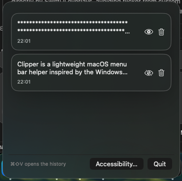

# Clipper

Clipper is a lightweight macOS menu bar helper inspired by the Windows clipboard history. It keeps the last 30 items you copy (text or images), presents a quick popover anchored to the cursor, and lets you re-paste with a single click.




## Features

- Global hotkey (`⌘⇧V`) to open the clipboard history anywhere.
- Menu bar icon for quick access, with an auto-hiding window that appears near your cursor.
- History for the 30 most recent clipboard entries, including plain text and screenshots/images.
- One-click paste: selecting an entry copies it back to the pasteboard and sends a `⌘V`.
- Per-item privacy controls to censor (mask with `*`) or delete individual entries.
- Simple Settings window with a slider to choose how many entries to keep (1–50), and a blacklist that lets you opt-out of capturing from specific apps.
- Full image support: screenshots and copied images (PNG/TIFF, even file URLs from macOS screenshots) are stored in history and can be re-pasted like text.
- Simple Settings panel (right-click the menu bar icon or open macOS Settings) with a slider to choose how many items to keep (1–50).
- Optional Accessibility shortcut to request the system permission needed for the global hotkey.

## Requirements

- macOS 13 Ventura or newer.
- Xcode 15 toolchain (or Swift 5.9+) installed locally.

## Development

```bash
swift build          # Compile the app
swift run Clipper    # Launch from the command line
```

Because this is a menu bar utility, keep the terminal session open while testing. The clipboard window shows up near your cursor; use `Esc` or click outside to dismiss it.

## Accessibility Permission

The global hotkey relies on the macOS Accessibility API. The first time Clipper runs it prompts macOS for permission. If the prompt doesn’t appear or the shortcut stops working:

1. Open System Settings → Privacy & Security → Accessibility.
2. Enable Clipper (or the terminal app you used to run it).
3. Restart the helper (`swift run Clipper`) so the hotkey monitor attaches.

## Roadmap Ideas

- Integrate with Handoff (have things copied from other devices).
- Persist history between launches (optional).
- Add search/filter across historical entries.
- Provide a settings pane for history length and visual customization.
